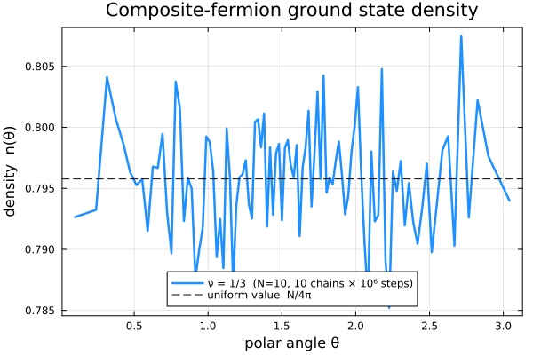

# CFsOnSphere.jl

*Composite-fermion wavefunctions on the sphere, for the fractional quantum Hall effect.*

CFsOnSphere builds **Jain–Kamilla projected** and **unprojected** composite-fermion (CF) and
parton wavefunctions on the Haldane sphere, and samples them with a Metropolis–Hastings–Gibbs
Monte Carlo walk to compute densities, pair correlations, energies, and overlaps. The
projection uses the quaternion/rotation reformulation of Jain–Kamilla projection
([Phys. Rev. Lett. 134, 156501 (2025)](https://doi.org/10.1103/PhysRevLett.134.156501)), which is far cheaper and more numerically
stable than the traditional mixed-derivative approach.

If you are new here, read the [Physics background](physics.md) for the concepts and notation,
then work through the [Tutorials](tutorials/01_ground_state.md).

## Installation

The package is not yet in the General registry, so install it from the repository:

```julia
using Pkg
Pkg.add(url="https://github.com/mytraya-gattu/CompositeFermions.git")
```

or, for development, clone it and `Pkg.develop` the checkout:

```bash
git clone https://github.com/mytraya-gattu/CompositeFermions.git
```
```julia
using Pkg; Pkg.develop(path="CompositeFermions")
```

## Quickstart

A complete program that builds the ``\nu = 1/3`` composite-fermion ground state, samples it with
Monte Carlo, and plots its density on the sphere. We go through it one block at a time — each
block is independent and links to where it is explained in full.

**1. Choose the state.** A Jain state is fixed by three integers: the number of particles `N`,
the number of filled Λ-levels `n`, and the Jastrow power `p` (the number of attached vortices,
*even*). They set the filling ``\nu = n/(pn+1)``. [`cf_ground_state_lm`](@ref) returns the
effective monopole strength `Qstar` and the occupied ``(L, L_z)`` orbitals — see
[Physics background](physics.md) for what these mean.

```julia
using CFsOnSphere, Random, LinearAlgebra, Statistics

N, n, p = 10, 1, 2                          # n=1, p=2  →  ν = 1/3
Qstar, l_m_list = cf_ground_state_lm(N, n, p)
```

**2. Define the sampling weight.** We sample positions with probability ``|\Psi|^2``. The walker
works with a *log* probability, and ``|\Psi|^2 = |\det|^2|\text{Jastrow}|^2``, so the log-pdf
reads the projected Slater determinant ([`Ψproj`](@ref)) and the cached Jastrow log off the
wavefunction object:

```julia
logpdf(ψ) = 2.0 * real(logdet(ψ.slater_det) + ψ.jastrow_factor_log)
```

**3. Run one Metropolis chain.** Allocate two wavefunction buffers (current + proposed),
thermalize with [`gibbs_thermalization!`](@ref) (which also tunes the step size `σ`), then sweep:
[`proposal`](@ref) moves one particle, [`update_wavefunction!`](@ref) updates that column, and on
accept/reject we keep the better state. [`update_density!`](@ref) accumulates an equal-area
``\theta`` histogram. (This is exactly the loop from [Tutorial 1](tutorials/01_ground_state.md),
wrapped in a function.)

```julia
function run_chain(seed; n_therm = 100_000, n_steps = 1_000_000, n_bins = 100)
    rng = MersenneTwister(seed)
    ψ, ψn = Ψproj(Qstar, p, N, l_m_list), Ψproj(Qstar, p, N, l_m_list)
    θ, ϕ = rand_θ_ϕ_gen(rng, N); θn, ϕn = copy(θ), copy(ϕ)
    it, σ, _, _ = gibbs_thermalization!(rng, ψ, ψn, θ, ϕ, θn, ϕn, π/sqrt(12), logpdf, n_therm)

    θmesh = acos.(LinRange(1.0, -1.0, n_bins + 1))     # equal-area bin edges
    dens = zeros(n_bins); lpc = logpdf(ψ)
    for _ in 1:n_steps
        θn[it], ϕn[it] = proposal(rng, θ[it], ϕ[it], σ)
        update_wavefunction!(ψn, θn[it], ϕn[it], it)
        if logpdf(ψn) - lpc >= log(rand(rng))
            θ[it], ϕ[it] = θn[it], ϕn[it]; copy!(ψ, ψn, it); lpc = logpdf(ψ)
        else
            θn[it], ϕn[it] = θ[it], ϕ[it]; copy!(ψn, ψ, it)
        end
        update_density!(θmesh, θ, dens)
        it = mod(it, N) + 1
    end
    Agrid = 2π .* (cos.(θmesh[1:end-1]) .- cos.(θmesh[2:end]))
    return θmesh, dens ./ n_steps ./ Agrid
end
```

**4. Average several independent chains.** Independent chains (different seeds) reduce the Monte
Carlo error; ten chains of a million steps give a smooth estimate.

```julia
results = [run_chain(seed) for seed in 1:10]          # 10 independent chains
θmesh   = results[1][1]
θc      = 0.5 .* (θmesh[1:end-1] .+ θmesh[2:end])     # bin centres
density = mean(last.(results))                        # average over chains
```

**5. Plot the density.** On the edgeless sphere the bulk density of an incompressible state is
flat, sitting at the uniform value ``N/4\pi``.

```julia
using Plots
plot(θc, density; lw = 2, xlabel = "θ", ylabel = "density n(θ)",
     label = "ν = 1/3  (N=10, 10 chains × 10⁶ steps)")
hline!([N / (4π)]; ls = :dash, label = "N / 4π")
```

Running the program above produces:



The density is flat to ``\sim 1\%`` across the sphere — the hallmark of the incompressible
``\nu = 1/3`` liquid. From here, [Tutorial 1](tutorials/01_ground_state.md) explains every step in
detail and adds the pair correlation; later tutorials cover excitations, higher fillings, fast
unprojected sampling, partons, and energies.

## What's inside

| Wavefunction | Description | Fast rank-1 updates? |
|---|---|---|
| [`Ψproj`](@ref)   | Jain–Kamilla projected CF state | No (a move changes every column) |
| [`Ψparton`](@ref) | Jain–Kamilla projected parton state | No |
| [`Ψunproj`](@ref) | unprojected `det·Jastrow` (single-particle orbitals) | **Yes (Sherman–Morrison)** |
| [`ΨoneLL`](@ref)  | bare Jastrow (Laughlin) | n/a |

## Where to go next

- [Physics background](physics.md) — LLL, composite fermions, the Jain–Kamilla projection, and the
  meaning of `Qstar`, `p`, and `l_m_list`.
- [Tutorials](tutorials/01_ground_state.md) — hands-on, example-driven walkthroughs.
- [API reference](api.md) — every exported function and type.
- [Architecture](architecture.md) — how the code is organized (for contributors).
- [Theory & citation](theory.md) — the method, the derivation, and how to cite.
